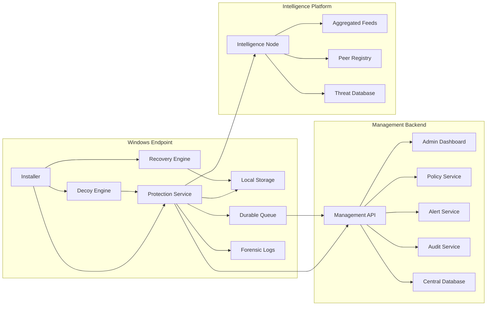
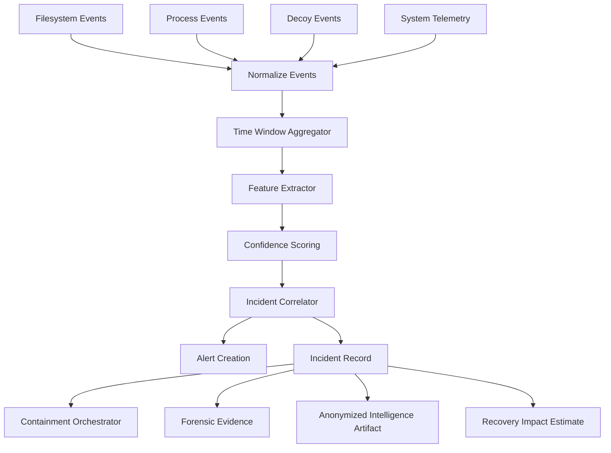
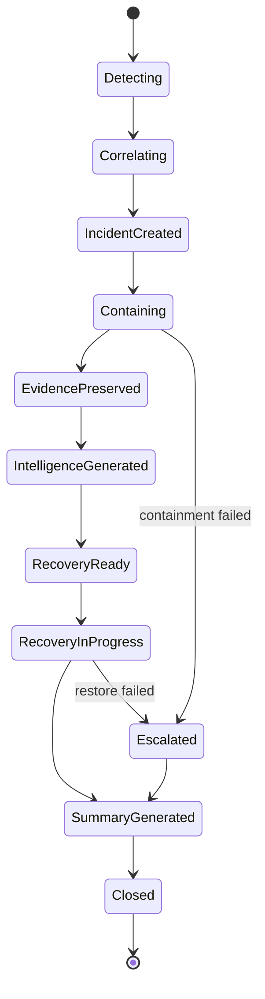
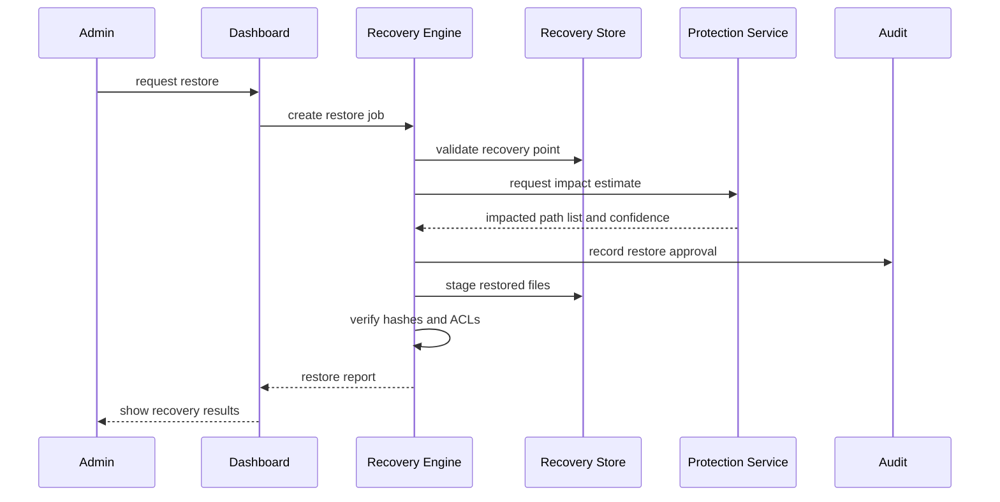
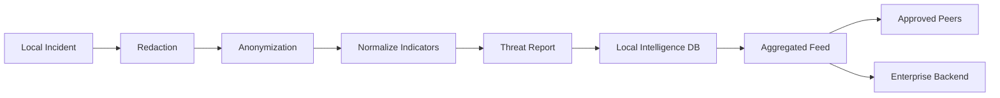

# Component Diagrams

## Logical Architecture

```mermaid
flowchart LR
  subgraph Endpoint["Windows Endpoint"]
    Installer["Installer"]
    Protection["Protection Service"]
    Decoy["Decoy Engine"]
    Recovery["Recovery Engine"]
    LocalStore["Local Storage"]
    LocalQueue["Durable Queue"]
    Forensics["Forensic Logs"]
  end

  subgraph Backend["Management Backend"]
    MgmtApi["Management API"]
    Dashboard["Admin Dashboard"]
    Policy["Policy Service"]
    Alerting["Alert Service"]
    Audit["Audit Service"]
    CentralDb["Central Database"]
  end

  subgraph Intel["Intelligence Platform"]
    IntelNode["Intelligence Node"]
    Feed["Aggregated Feeds"]
    Peer["Peer Registry"]
    ThreatDb["Threat Database"]
  end

  Installer --> Protection
  Installer --> Decoy
  Installer --> Recovery
  Protection --> LocalStore
  Protection --> LocalQueue
  Protection --> Forensics
  Decoy --> Protection
  Recovery --> LocalStore
  Protection --> MgmtApi
  LocalQueue --> MgmtApi
  MgmtApi --> Dashboard
  MgmtApi --> Policy
  MgmtApi --> Alerting
  MgmtApi --> Audit
  MgmtApi --> CentralDb
  Protection --> IntelNode
  IntelNode --> ThreatDb
  IntelNode --> Feed
  IntelNode --> Peer
```

## Endpoint Detection Pipeline

```mermaid
flowchart TD
  FsEvents["Filesystem Events"] --> Normalize["Normalize Events"]
  ProcEvents["Process Events"] --> Normalize
  DecoyEvents["Decoy Events"] --> Normalize
  SystemTelemetry["System Telemetry"] --> Normalize

  Normalize --> Window["Time Window Aggregator"]
  Window --> Features["Feature Extractor"]
  Features --> Scoring["Confidence Scoring"]
  Scoring --> Correlator["Incident Correlator"]
  Correlator --> Alert["Alert Creation"]
  Correlator --> Incident["Incident Record"]
  Incident --> Containment["Containment Orchestrator"]
  Incident --> Forensics["Forensic Evidence"]
  Incident --> Intel["Anonymized Intelligence Artifact"]
  Incident --> Recovery["Recovery Impact Estimate"]
```

## Incident Lifecycle

```mermaid
stateDiagram-v2
  [*] --> Detecting
  Detecting --> Correlating
  Correlating --> IncidentCreated
  IncidentCreated --> Containing
  Containing --> EvidencePreserved
  EvidencePreserved --> IntelligenceGenerated
  IntelligenceGenerated --> RecoveryReady
  RecoveryReady --> RecoveryInProgress
  RecoveryInProgress --> SummaryGenerated
  SummaryGenerated --> Closed
  Containing --> Escalated: containment failed
  RecoveryInProgress --> Escalated: restore failed
  Escalated --> SummaryGenerated
  Closed --> [*]
```

## Recovery Flow

```mermaid
sequenceDiagram
  participant Admin
  participant Dashboard
  participant Recovery as Recovery Engine
  participant Store as Recovery Store
  participant Protect as Protection Service
  participant Audit

  Admin->>Dashboard: request restore
  Dashboard->>Recovery: create restore job
  Recovery->>Store: validate recovery point
  Recovery->>Protect: request impact estimate
  Protect-->>Recovery: impacted path list and confidence
  Recovery->>Audit: record restore approval
  Recovery->>Store: stage restored files
  Recovery->>Recovery: verify hashes and ACLs
  Recovery-->>Dashboard: restore report
  Dashboard-->>Admin: show recovery results
```

## Intelligence Sharing

```mermaid
flowchart LR
  Incident["Local Incident"] --> Redact["Redaction"]
  Redact --> Anonymize["Anonymization"]
  Anonymize --> Normalize["Normalize Indicators"]
  Normalize --> Report["Threat Report"]
  Report --> LocalIntel["Local Intelligence DB"]
  LocalIntel --> Feed["Aggregated Feed"]
  Feed --> Peers["Approved Peers"]
  Feed --> Backend["Enterprise Backend"]
```

